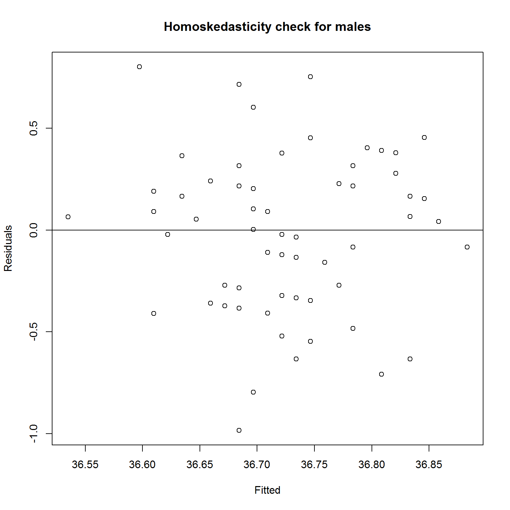
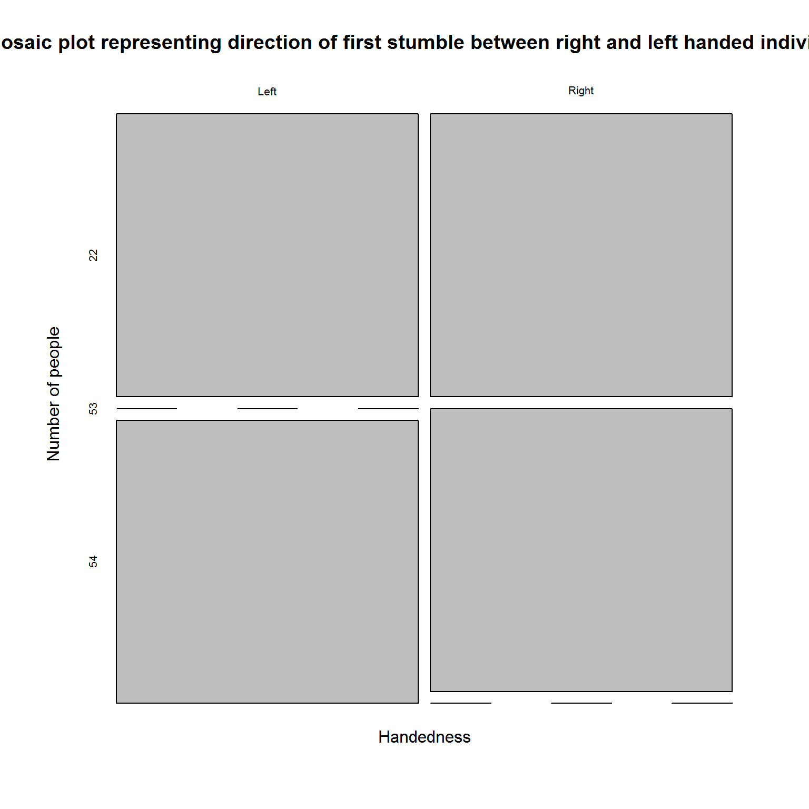
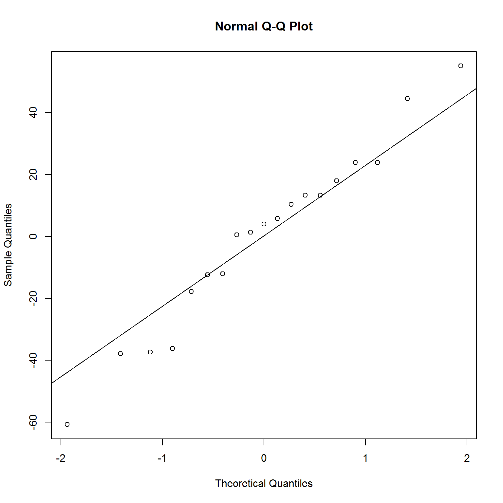
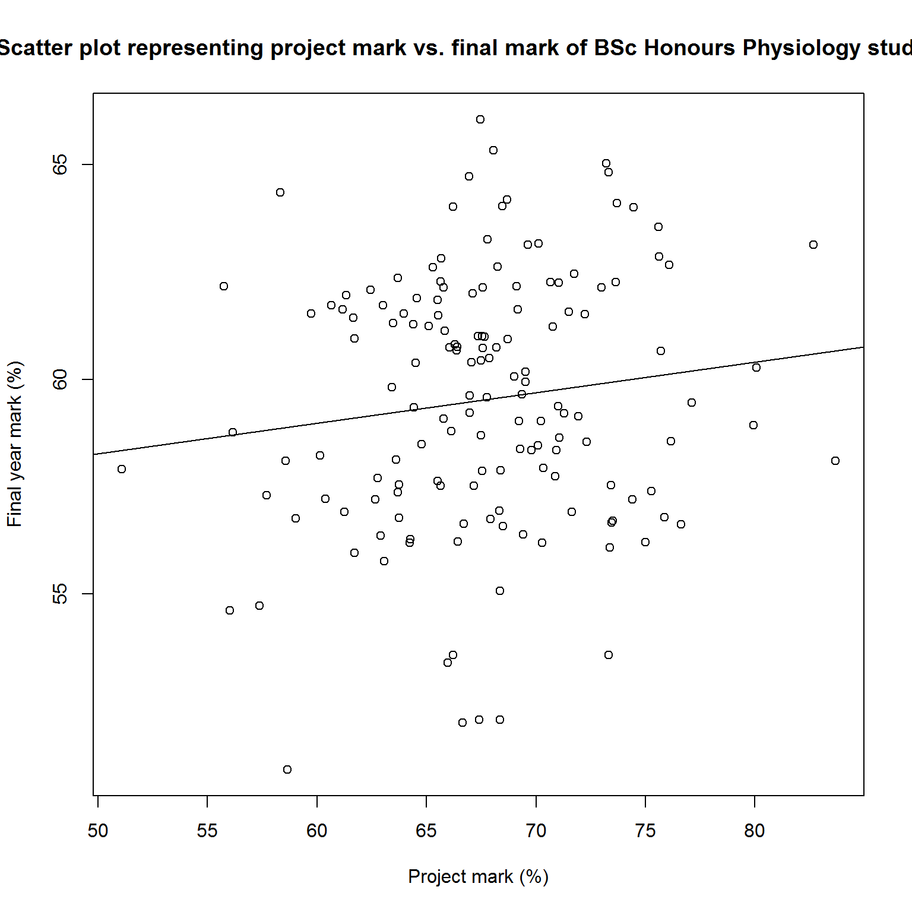

PHSL4005 Stats. Exam
================
Vishaylin J. Mahadeo
August 31, 2016

Question 1
==========

Body Temperature association between males and female heart rates
-----------------------------------------------------------------

``` r
#load data set
df_Q1 <- read_csv('question1.csv')

#view first 6 lines of data set
head(df_Q1, 6)
```

    ## # A tibble: 6 x 3
    ##   body_temperature  male female
    ##              <dbl> <int>  <int>
    ## 1             35.7    70     NA
    ## 2             35.8    NA     69
    ## 3             35.9    71     NA
    ## 4             35.9    NA     62
    ## 5             36.0    NA     75
    ## 6             36.1    74     NA

``` r
#tidy data (Collect males)
Q1_male <- df_Q1 %>% 
  filter(male != 'NA') %>%
  select(body_temperature, male)
Q1_male
```

    ## # A tibble: 65 x 2
    ##    body_temperature  male
    ##               <dbl> <int>
    ## 1              35.7    70
    ## 2              35.9    71
    ## 3              36.1    74
    ## 4              36.1    80
    ## 5              36.2    73
    ## 6              36.2    75
    ## 7              36.2    82
    ## 8              36.2    64
    ## 9              36.3    69
    ## 10             36.3    70
    ## # ... with 55 more rows

``` r
#tidy data (Collect females)
Q1_female <- df_Q1 %>%
  filter(female != 'NA') %>%
  select(body_temperature, female)
Q1_female
```

    ## # A tibble: 65 x 2
    ##    body_temperature female
    ##               <dbl>  <int>
    ## 1              35.8     69
    ## 2              35.9     62
    ## 3              36.0     75
    ## 4              36.2     66
    ## 5              36.2     68
    ## 6              36.3     57
    ## 7              36.4     61
    ## 8              36.5     84
    ## 9              36.5     61
    ## 10             36.6     77
    ## # ... with 55 more rows

``` r
#plot data (males)
male_plot <- plot(x = Q1_male$male, y = Q1_male$body_temperature,
                  main = 'Scatter plot showing male heart rate vs. body temperature',
                  xlab = 'Male heart rate (BPM)',
                  ylab = 'Body temperature (degrees Celcius)')

#linear regression for males
male_rgl <- lm(body_temperature~male, data = Q1_male)
abline(male_rgl)
```


``` r
#print regression line for males
summary(male_rgl)
```

    ## 
    ## Call:
    ## lm(formula = body_temperature ~ male, data = Q1_male)
    ## 
    ## Residuals:
    ##      Min       1Q   Median       3Q      Max 
    ## -0.98425 -0.28425  0.05305  0.24062  0.80280 
    ## 
    ## Coefficients:
    ##              Estimate Std. Error t value Pr(>|t|)    
    ## (Intercept) 35.813752   0.601771  59.514   <2e-16 ***
    ## male         0.012436   0.008176   1.521    0.133    
    ## ---
    ## Signif. codes:  0 '***' 0.001 '**' 0.01 '*' 0.05 '.' 0.1 ' ' 1
    ## 
    ## Residual standard error: 0.3843 on 63 degrees of freedom
    ## Multiple R-squared:  0.03542,    Adjusted R-squared:  0.02011 
    ## F-statistic: 2.313 on 1 and 63 DF,  p-value: 0.1333

``` r
#check homoskedasticity
male_homosk <- plot(x = male_rgl$fitted, y = male_rgl$residuals,
                    main = 'Homoskedasticity check for males',
                    xlab = 'Fitted', ylab = 'Residuals')
abline(h=0)
```



``` r
#Check Gaussian distribution
qqnorm(male_rgl$residuals)
qqline(male_rgl$residuals)
```


``` r
#plot data (females)
female_plot <- plot(x = Q1_female$female, y = Q1_female$body_temperature,
                    main = 'Scatter plot showing female heart rate vs. body temperature',
                    xlab = 'Female heart rate (BPM)',
                    ylab = 'Body temperature (degrees Celcius)')

#linear regression for females
female_rgl <- lm(body_temperature~female, data = Q1_female)
abline(female_rgl)
```


``` r
#print regression line for females
summary(female_rgl)
```

    ## 
    ## Call:
    ## lm(formula = body_temperature ~ female, data = Q1_female)
    ## 
    ## Residuals:
    ##      Min       1Q   Median       3Q      Max 
    ## -1.01469 -0.21469 -0.01469  0.24192  1.26961 
    ## 
    ## Coefficients:
    ##              Estimate Std. Error t value Pr(>|t|)    
    ## (Intercept) 35.816769   0.458825  78.062   <2e-16 ***
    ## female       0.014463   0.006151   2.351   0.0219 *  
    ## ---
    ## Signif. codes:  0 '***' 0.001 '**' 0.01 '*' 0.05 '.' 0.1 ' ' 1
    ## 
    ## Residual standard error: 0.3989 on 63 degrees of freedom
    ## Multiple R-squared:  0.08066,    Adjusted R-squared:  0.06607 
    ## F-statistic: 5.528 on 1 and 63 DF,  p-value: 0.02186

``` r
#check homoskedasticity
female_homosk <- plot(x = female_rgl$fitted, y = female_rgl$residuals,
                    main = 'Homoskedasticity check for females',
                    xlab = 'Fitted', ylab = 'Residuals')
abline(h=0)
```


``` r
#Check Gaussian distribution
qqnorm(female_rgl$residuals)
qqline(female_rgl$residuals)
```

 **Null Hypothesis:** Heart rates in males and females have no association with body temperature.

**Alternative Hypothesis:** Heart rates in males and females have an association with body temperature.

**Assumptions:**

1.  a = 0.05

2.  Paired, continuous data set.

3.  Parametric data set because normal distribution indicated by a normal Q-Q plot.

4.  Residuals are normally distributed as shown by homoskedasticity check.

5.  Reject null hypothesis if p &lt; a.

6.  Pearson's correlation will be used to test hypothesis.

``` r
#male Pearson's correlation
male_cor <- with(Q1_male,
                 cor.test(x = male, y = body_temperature,
                          method = 'pearson'))
male_cor
```

    ## 
    ##  Pearson's product-moment correlation
    ## 
    ## data:  male and body_temperature
    ## t = 1.521, df = 63, p-value = 0.1333
    ## alternative hypothesis: true correlation is not equal to 0
    ## 95 percent confidence interval:
    ##  -0.05837844  0.41313575
    ## sample estimates:
    ##       cor 
    ## 0.1882004

``` r
#male paired t-test
male_test <- t.test(Q1_male$male, Q1_male$body_temperature, paired = TRUE)
male_test
```

    ## 
    ##  Paired t-test
    ## 
    ## data:  Q1_male$male and Q1_male$body_temperature
    ## t = 50.807, df = 64, p-value < 2.2e-16
    ## alternative hypothesis: true difference in means is not equal to 0
    ## 95 percent confidence interval:
    ##  35.20228 38.08387
    ## sample estimates:
    ## mean of the differences 
    ##                36.64308

``` r
#female Pearson's correlation
female_cor <- with(Q1_female,
                 cor.test(x = female, y = body_temperature,
                          method = 'pearson'))
female_cor
```

    ## 
    ##  Pearson's product-moment correlation
    ## 
    ## data:  female and body_temperature
    ## t = 2.3511, df = 63, p-value = 0.02186
    ## alternative hypothesis: true correlation is not equal to 0
    ## 95 percent confidence interval:
    ##  0.04310142 0.49371392
    ## sample estimates:
    ##       cor 
    ## 0.2840149

``` r
#female paired t-test
female_test <- t.test(Q1_female$female, Q1_female$body_temperature, paired = TRUE)
female_test
```

    ## 
    ##  Paired t-test
    ## 
    ## data:  Q1_female$female and Q1_female$body_temperature
    ## t = 37.565, df = 64, p-value < 2.2e-16
    ## alternative hypothesis: true difference in means is not equal to 0
    ## 95 percent confidence interval:
    ##  35.28286 39.24637
    ## sample estimates:
    ## mean of the differences 
    ##                37.26462

**Results:**

Males presented with t(64) = 50.81; p &lt; 0.001 and R<sup>2</sup>= 0.188; F(0.384)=2.313

Females presented with t(64) = 37.57; p &lt; 0.001 and R<sup>2</sup>= 0.284; F(0.399)=5.528

p &lt; a, thus reject null hypotheis and accept alternative.

**Conclusion:** In conclusion there is a weak, positive association between heart rates in both males and females and their body temperature.

------------------------------------------------------------------------

Question 2 (*incomplete*)
=========================

Handedness compared to ataxic walking and intoxication
------------------------------------------------------

``` r
#load data set
df_Q2 <- read.csv('question2.csv')

#select data
Q2_data <- df_Q2 %>%
  select(handedness, final_position)

Q2_data2 <- df_Q2 %>%
  select(handedness, first_stumble)
         
#display data
head(Q2_data, 6)
```

    ##   handedness final_position
    ## 1          1              1
    ## 2          1              1
    ## 3          1              1
    ## 4          1              0
    ## 5          1              0
    ## 6          0              1

``` r
head(Q2_data2)
```

    ##   handedness first_stumble
    ## 1          1             1
    ## 2          1             1
    ## 3          1             1
    ## 4          1             1
    ## 5          1             0
    ## 6          0             0

``` r
#Counts (handedness and first stumble)
#Right hand with right side
rightS_side <- Q2_data2 %>%
  filter(handedness == 1) %>%
filter(first_stumble == 1)
  
rightS_count <- count(rightS_side)
rightS_count
```

    ## # A tibble: 1 x 1
    ##       n
    ##   <int>
    ## 1    53

``` r
#Left hand with left side
leftS_side <- Q2_data2 %>%
  filter(handedness == 0) %>%
  filter(first_stumble == 0)
  
leftS_count <- count(leftS_side)
leftS_count
```

    ## # A tibble: 1 x 1
    ##       n
    ##   <int>
    ## 1    54

``` r
#Right hand with left side
rightS_left <- Q2_data2 %>%
  filter(handedness == 1) %>%
  filter(first_stumble == 0)

rightS_left_count <- count(rightS_left)
rightS_left_count
```

    ## # A tibble: 1 x 1
    ##       n
    ##   <int>
    ## 1    22

``` r
#Left hand with right side
leftS_right <- Q2_data2 %>%
  filter(handedness == 0) %>%
  filter(first_stumble == 1)

left_rightS_count <- count(leftS_right)
left_rightS_count
```

    ## # A tibble: 1 x 1
    ##       n
    ##   <int>
    ## 1    22

``` r
#Counts (handedness and position and end of walk)
#Right hand with right side
right_side <- Q2_data %>%
  filter(handedness == 1) %>%
filter(final_position == 1)
  
right_count <- count(right_side)
right_count
```

    ## # A tibble: 1 x 1
    ##       n
    ##   <int>
    ## 1    48

``` r
#Left hand with left side
left_side <- Q2_data %>%
  filter(handedness == 0) %>%
  filter(final_position == 0)
  
left_count <- count(left_side)
left_count
```

    ## # A tibble: 1 x 1
    ##       n
    ##   <int>
    ## 1    40

``` r
#Right hand with left side
right_left <- Q2_data %>%
  filter(handedness == 1) %>%
  filter(final_position == 0)

right_left_count <- count(right_left)
right_left_count
```

    ## # A tibble: 1 x 1
    ##       n
    ##   <int>
    ## 1    27

``` r
#Left hand with right side
left_right <- Q2_data %>%
  filter(handedness == 0) %>%
  filter(final_position == 1)

left_right_count <- count(left_right)
left_right_count
```

    ## # A tibble: 1 x 1
    ##       n
    ##   <int>
    ## 1    36

``` r
#Form table
Q2_dataFrame <- data.frame(Handedness = c('Right', 'Left'),
                           Direction_first_stumble = c(53,22,22,54),
                           Position_at_end = c(48,27,36,40))
Q2_dataFrame
```

    ##   Handedness Direction_first_stumble Position_at_end
    ## 1      Right                      53              48
    ## 2       Left                      22              27
    ## 3      Right                      22              36
    ## 4       Left                      54              40

``` r
#plot data
direction_plot <- xtabs(~Handedness + Direction_first_stumble, data = Q2_dataFrame)
mosaicplot(direction_plot,
           main = 'Mosaic plot representing direction of first stumble between right and left handed individuals',
           xlab = 'Handedness', ylab = 'Number of people')
```



``` r
position_plot <- xtabs(~Handedness + Position_at_end, data = Q2_dataFrame)
mosaicplot(position_plot,
           main = 'Mosaic plot representing position at the end of line between right and left handed individuals', 
           xlab = 'Handedness', ylab = 'Number of people')
```


**Null Hypothesis:** Handedness is not associated with ataxic walking in intoxicated individuals.

**Alternative Hypothesis:** Handedness is associated with ataxic walking in intoxicated individuals.

**Assumptions:**

1.  a = 0.05

2.  Paired data set

3.  Parametric data set

4.  Reject null hypothesis if p &lt; a

5.  Fisher's exact test with a Holm adustment method will be required to test hypothesis.

``` r
#Test counts of first stumble and position and the end line with handedness of individuals.

#handedness and stumble test


#handedness and position at the end test
```

------------------------------------------------------------------------

Question 3
==========

Can running time be used to predict calories burned?
----------------------------------------------------

``` r
#load data set
df_Q3 <- read_csv('question3.csv')

#plot data set
Q3_plot <- plot(time~calories, data = df_Q3,
                main = 'Scatter plot representing running time vs. calories burnt' ,
                xlab = 'Running Time (s)', ylab = 'Calories consumed(cal)')

#tidy data
Q3_run <- select(df_Q3, time, calories)

#linear regression 
run_rgl <- lm(calories~time, data = Q3_run)
abline(run_rgl)
```


``` r
#print regression line for males
summary(run_rgl)
```

    ## 
    ## Call:
    ## lm(formula = calories ~ time, data = Q3_run)
    ## 
    ## Residuals:
    ##    Min     1Q Median     3Q    Max 
    ## -60.76 -15.09   4.04  15.67  55.21 
    ## 
    ## Coefficients:
    ##              Estimate Std. Error t value Pr(>|t|)    
    ## (Intercept) 939.36422  150.70365   6.233 9.09e-06 ***
    ## time         -0.28031    0.07432  -3.772  0.00152 ** 
    ## ---
    ## Signif. codes:  0 '***' 0.001 '**' 0.01 '*' 0.05 '.' 0.1 ' ' 1
    ## 
    ## Residual standard error: 30.17 on 17 degrees of freedom
    ## Multiple R-squared:  0.4556, Adjusted R-squared:  0.4235 
    ## F-statistic: 14.22 on 1 and 17 DF,  p-value: 0.001522

``` r
#check homoskedasticity
run_homosk <- plot(x = run_rgl$fitted, y = run_rgl$residuals,
                    main = 'Homoskedasticity check for running time vs. calories consumed',
                    xlab = 'Fitted', ylab = 'Residuals')
abline(h=0)
```


``` r
#Check Gaussian distribution
qqnorm(run_rgl$residuals)
qqline(run_rgl$residuals)
```



**Null Hypothesis:** Running time (s) cannot be used to predict number of calories consumed (cal) during a run.

**Alternative Hypothesis:** Running time (s) can be used to predict number of calories consumed (cal) during a run.

**Assumptions:**

1.  a = 0.05

2.  Paired, interval data set with no outliers.

3.  Gaussian residual distribution(i.e.normal distribution) indicated by normal Q-Q plot.

4.  Parametric data set.

5.  Residuals are heteroskedastic because they show spread around the abline at 0.

6.  Running time is measured without error.

7.  Observations are independent.

8.  If p &lt; a reject null hypothesis.

9.  A Pearson's correlation will be used to test hypothesis.

``` r
#Pearson's correlation
run_cor <- with(Q3_run,
                 cor.test(x = time, y = calories,
                          method = 'pearson'))
run_cor
```

    ## 
    ##  Pearson's product-moment correlation
    ## 
    ## data:  time and calories
    ## t = -3.7715, df = 17, p-value = 0.001522
    ## alternative hypothesis: true correlation is not equal to 0
    ## 95 percent confidence interval:
    ##  -0.8642170 -0.3183295
    ## sample estimates:
    ##        cor 
    ## -0.6749491

``` r
#calculate regression coefficient
regco <- coefficients(run_rgl)
regco
```

    ## (Intercept)        time 
    ## 939.3642218  -0.2803149

``` r
#fit coeffiecients into regression formula
origTime <- 30
decTimeSec <- origTime * 60
run_time <- mean(df_Q3$run) - decTimeSec
CaloriesC <- regco[1] + regco[2] * run_time
CaloriesC
```

    ## (Intercept) 
    ##    1441.128

**Results:**

t(17) = -3.771; p = 0.002 and R<sup>2</sup>= -0.674; F(17)= 14.22

p &lt; a, thus reject null hypothesis.

**Conclusion:** Running time has a strong, negative correlation with calories burnt. Therefore the shorter runs burn more calories than longer runs.

Furthermore if she decreased her running time by 30 minutes she would burn 1441.128 calories.

------------------------------------------------------------------------

Questions 4
===========

The relationship between project mark and final mark for BSc Honours Physiology students over 10 years.
-------------------------------------------------------------------------------------------------------

``` r
foo <- rnorm(10000, mean = 60, sd = 3) # final mark
bar <- rnorm(10000, mean = 68, sd = 5) # project mark
baz <- rep(seq(from = 1997, to = 2006), each = 1) # years

year <- sample(baz, 150, replace = TRUE,
               prob = c(0.05, 0.05, 0.08, 0.08, 
                          0.1, 0.13, 0.14, 0.13, 0.12, 0.12))
project_mark <- sample(bar, 150, replace = TRUE)
final_mark <- sample(foo, 150, replace = TRUE)

plot_data <- data_frame(year = year,
                        project_mark = round(project_mark, 1),
                        final_mark = round(final_mark, 1)) %>%
    arrange(year)
#Print out data
head(plot_data, 6)
```

    ## # A tibble: 6 x 3
    ##    year project_mark final_mark
    ##   <int>        <dbl>      <dbl>
    ## 1  1997         68.5       65.9
    ## 2  1997         68.9       56.2
    ## 3  1997         65.4       62.8
    ## 4  1997         70.0       61.2
    ## 5  1997         69.9       57.1
    ## 6  1997         67.5       56.1

``` r
#Scatter plot of data
mark_plot <- plot(x = project_mark, y = final_mark,
     main = 'Scatter plot representing project mark vs. final mark of BSc Honours Physiology students',
     xlab = 'Project mark (%)', ylab = 'Final year mark (%)')

#regression line
mark_regl <- lm(final_mark~project_mark)
abline(mark_regl)
```



``` r
#print summary of regression
summary(mark_regl)
```

    ## 
    ## Call:
    ## lm(formula = final_mark ~ project_mark)
    ## 
    ## Residuals:
    ##     Min      1Q  Median      3Q     Max 
    ## -8.2422 -1.9513 -0.3337  1.8955  9.4795 
    ## 
    ## Coefficients:
    ##               Estimate Std. Error t value Pr(>|t|)    
    ## (Intercept)  5.973e+01  3.713e+00   16.09   <2e-16 ***
    ## project_mark 1.611e-05  5.461e-02    0.00        1    
    ## ---
    ## Signif. codes:  0 '***' 0.001 '**' 0.01 '*' 0.05 '.' 0.1 ' ' 1
    ## 
    ## Residual standard error: 3.064 on 148 degrees of freedom
    ## Multiple R-squared:  5.88e-10,   Adjusted R-squared:  -0.006757 
    ## F-statistic: 8.703e-08 on 1 and 148 DF,  p-value: 0.9998

**Explanation of axis:**

**x-axis =** project mark (independent variable) because is not affected by final year mark, however affects final year mark.

**y-axis =** final year marl (dependent variable) because is affected by individual project marks over the years.

------------------------------------------------------------------------
